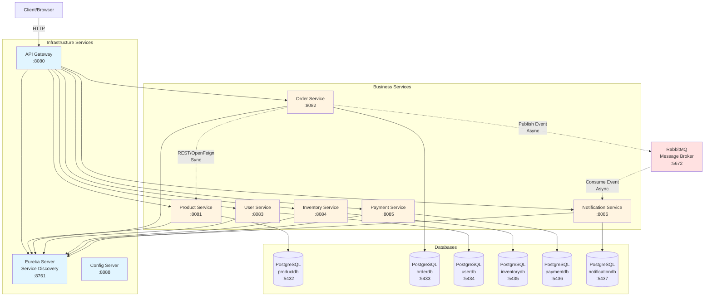

# E-Commerce Microservices System

Mikroservisni sistem za e-commerce razvijen korišćenjem Spring Cloud framework-a.

## Pregled Sistema

Sistem se sastoji od više nezavisnih mikroservisa koji komuniciraju međusobno kako sinhrono (REST API) tako i asinhrono (message broker).

## Arhitektura



**Legenda:**
- 🔵 Plava - Infrastrukturni servisi
- 🟡 Žuta - Poslovni servisi
- 🔴 Crvena - Message broker
- **Puna linija** → Direktna komunikacija
- **Isprekidana linija** ⇢ REST/Async komunikacija

## Servisi

### Infrastrukturni Servisi
- **Eureka Server** (port 8761) - Service Discovery i registracija servisa
- **Config Server** (port 8888) - Centralizovana konfiguracija
- **API Gateway** (port 8080) - Routing i load balancing

### Poslovni Servisi
- **Product Service** (port 8081) - Upravljanje proizvodima (CRUD operacije)
- **Order Service** (port 8082) - Upravljanje porudžbinama sa sinhronom komunikacijom (OpenFeign)
- **User Service** (port 8083) - Autentifikacija korisnika (JWT, role-based access)
- **Inventory Service** (port 8084) - Upravljanje zalihama
- **Payment Service** (port 8085) - Obrada plaćanja
- **Notification Service** (port 8086) - Slanje obaveštenja (asinhrona komunikacija preko RabbitMQ)

## Product Service API

Product Service pruža REST API za upravljanje proizvodima:

### Endpoints
- `POST /api/products` - Kreiranje novog proizvoda
- `GET /api/products` - Lista svih proizvoda
  - Query parametri: `?category=Electronics`, `?search=keyword`, `?activeOnly=true`
- `GET /api/products/{id}` - Proizvod po ID-u
- `GET /api/products/sku/{sku}` - Proizvod po SKU-u
- `PUT /api/products/{id}` - Ažuriranje proizvoda
- `PATCH /api/products/{id}/stock?quantity=50` - Ažuriranje zaliha
- `DELETE /api/products/{id}` - Brisanje proizvoda

### Primer Request Body
```json
{
  "sku": "LAPTOP-001",
  "name": "Gaming Laptop",
  "description": "High-performance gaming laptop",
  "price": 1299.99,
  "stockQuantity": 50,
  "category": "Electronics",
  "imageUrl": "http://example.com/laptop.jpg",
  "active": true
}
```

## Order Service API

Order Service upravlja porudžbinama i komunicira sa Product Service-om putem OpenFeign klijenta.

### Sinhrona Komunikacija
Order Service koristi **Spring Cloud OpenFeign** za REST pozive prema Product Service-u:
- Validacija dostupnosti proizvoda
- Provera stanja zaliha
- Preuzimanje cena i detalja proizvoda

### Endpoints
- `POST /api/orders` - Kreiranje nove porudžbine
- `GET /api/orders` - Lista svih porudžbina
  - Query parametri: `?customerEmail=test@test.com`, `?status=PENDING`
- `GET /api/orders/{id}` - Porudžbina po ID-u
- `GET /api/orders/number/{orderNumber}` - Porudžbina po broju porudžbine
- `PATCH /api/orders/{id}/status?status=CONFIRMED` - Ažuriranje statusa
- `DELETE /api/orders/{id}` - Otkazivanje porudžbine

### Order Status Flow
`PENDING` → `CONFIRMED` → `PROCESSING` → `SHIPPED` → `DELIVERED`
(ili `CANCELLED` u bilo kom momentu pre DELIVERED)

### Primer Request Body
```json
{
  "customerEmail": "john.doe@example.com",
  "customerName": "John Doe",
  "shippingAddress": "123 Main St, New York, NY 10001",
  "items": [
    {
      "productSku": "LAPTOP-001",
      "quantity": 2
    }
  ]
}
```

### Validacija
- Proizvodi moraju da postoje u Product Service-u
- Proizvodi moraju biti aktivni (active=true)
- Dovoljno stanja zaliha za traženu količinu
- Automatsko generisanje jedinstvenog broja porudžbine (ORD-XXXXXXXX)
- Automatski izračunata ukupna cena

## User Service API

User Service upravlja korisnicima i pruža JWT autentifikaciju sa role-based access control.

### Sigurnost
- **JWT Token** autentifikacija
- **BCrypt** hashing lozinki
- **Role-based access** (USER, ADMIN)
- Session stateless (ne koristi server-side sessions)

### Endpoints

#### Javni (bez autentifikacije)
- `POST /api/users/register` - Registracija novog korisnika
- `POST /api/users/login` - Login i dobijanje JWT tokena

#### Zaštićeni (zahtevaju JWT token)
- `GET /api/users/{id}` - Detalji korisnika po ID-u (USER, ADMIN)
- `GET /api/users/email/{email}` - Korisnik po email-u (USER, ADMIN)
- `PUT /api/users/{id}` - Ažuriranje korisnika (USER, ADMIN)

#### Admin Only
- `GET /api/users` - Lista svih korisnika (ADMIN)
  - Query parametri: `?activeOnly=true`
- `PATCH /api/users/{id}/deactivate` - Deaktivacija korisnika (ADMIN)
- `PATCH /api/users/{id}/activate` - Aktivacija korisnika (ADMIN)
- `DELETE /api/users/{id}` - Brisanje korisnika (ADMIN)
- `PATCH /api/users/admin/promote/{id}` - Promocija u ADMIN (ADMIN)

### Primer Registration Request
```json
{
  "username": "johndoe",
  "email": "john@example.com",
  "password": "securepass123",
  "firstName": "John",
  "lastName": "Doe",
  "phoneNumber": "123-456-7890"
}
```

### Primer Login Request/Response
Request:
```json
{
  "usernameOrEmail": "johndoe",
  "password": "securepass123"
}
```

Response:
```json
{
  "token": "eyJhbGciOiJIUzI1NiIsInR5cCI6IkpXVCJ9...",
  "type": "Bearer",
  "userId": 1,
  "username": "johndoe",
  "email": "john@example.com",
  "role": "USER"
}
```

### Korišćenje JWT Tokena
Nakon uspešnog login-a, JWT token se prosleđuje u svim zahtevima:
```
Authorization: Bearer <jwt-token>
```

## Inventory Service API

- `POST /api/inventory` - Kreiranje novog Inventory zapisa
- `GET /api/inventory/product/{productId}` - Dobijanje zaliha za proizvod
- `PATCH /api/inventory/{id}/adjust?quantity=10` - Ažuriranje količine

## Payment Service API

- `POST /api/payments` - Kreiranje novog plaćanja
- `GET /api/payments/{id}` - Detalji plaćanja
- `GET /api/payments/order/{orderId}` - Plaćanja za porudžbinu

## Notification Service API

- `GET /api/notifications/user/{userId}` - Sve notifikacije za korisnika
- RabbitMQ Consumer: prima događaje o porudžbinama i automatski kreira notifikacije

## Komunikacija između servisa

### Sinhrona komunikacija (REST/OpenFeign)
- Order Service → Product Service (validacija proizvoda, provera zaliha)

### Asinhrona komunikacija (RabbitMQ)
- Order Service → Notification Service (slanje obaveštenja o novim porudžbinama)

## Tehnologije

- Java 17
- Spring Boot 3.2.5
- Spring Cloud 2023.0.1
- Spring Security + JWT (JSON Web Tokens)
- PostgreSQL (Database per service pattern)
- RabbitMQ (Message broker)
- Docker & Docker Compose
- Maven
- JUnit 5 & Mockito
- JaCoCo (Code Coverage)
- GitHub Actions (CI/CD)

## Testiranje

### Pokretanje testova

```bash
# Svi testovi za ceo projekat
mvn clean test

# Testovi za specifičan servis
cd product-service
mvn test

# Sa code coverage izveštajem
mvn test jacoco:report

# Pregled coverage izveštaja
open target/site/jacoco/index.html
```

### Test konfiguracija
- **Test baza**: H2 in-memory database
- **Mocking**: Mockito za unit testove
- **Integration testovi**: Spring Boot Test sa MockMvc
- **Feign client testovi**: MockBean za eksterne pozive

## CI/CD Pipeline

Projekat koristi **GitHub Actions** za automatizovani CI/CD proces.

### Pipeline Faze

```
BUILD → TEST → INTEGRATION-TEST → PACKAGE → DEPLOY
```

### Workflow Triggeri
- **Push na `develop`**: Pokreće pipeline i deploy na Development
- **Push na `main`**: Pokreće pipeline i deploy na Staging + Production (manual approval)
- **Pull Request**: Pokreće BUILD + TEST faze

### Deployment Okruženja

| Environment | Branch | Deployment | URL |
|-------------|--------|------------|-----|
| Development | `develop` | Automatski | http://dev.yourapp.com |
| Staging | `main` | Automatski | http://staging.yourapp.com |
| Production | `main` | Manual approval | http://yourapp.com |

### Detaljnije informacije

Za detaljne informacije o pipeline-u, pogledaj [PIPELINE.md](PIPELINE.md).

## Pokretanje Sistema

```bash
# Build all services
mvn clean install

# Start with Docker Compose
docker-compose up -d
```

## Napomene

Sistem koristi **Database per Service** pattern - svaki mikroservis ima svoju nezavisnu PostgreSQL bazu podataka, što omogućava nezavisno skaliranje i deploy.

Komunikacija između servisa je realizovana putem **Spring Cloud OpenFeign** klijenta koji pruža deklarativni REST klijent sa automatskim load balancing-om i service discovery integracijom.